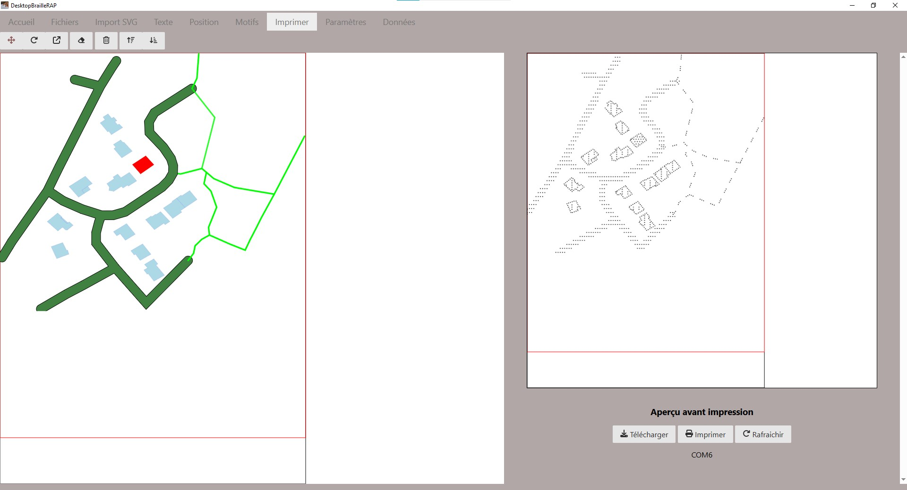
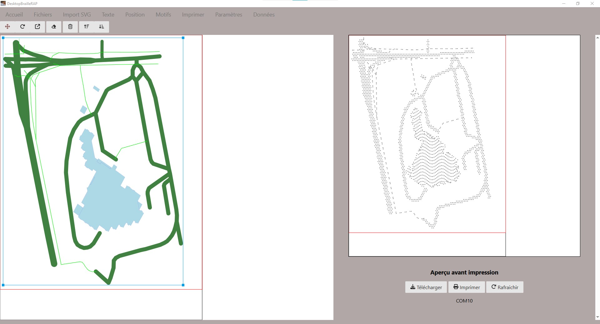

# OpenStreetTouch

A tool to extract geodata from openstreetmap and create suitable file for image2touch or DesktopBrailleRAP. The main goal is to extract openstreetmap data to build tangible maps.

In many cities, public transport map are not available in Braille nor in suitable format to build accessible description. Most of the needed data is available in [openstreetmap](https://www.openstreetmap.org/) in open database licence. OpenStreetTouch aim to extract these data to build accessible transport map.

Here is an exemple with DesktopBrailleRAP on a residential area in France.



Another exemple with the Askoria campus in Rennes - France


## Features
- Build SVG map from public transport data. These SVG can then be use to build tangible map with a laser cutter, a 3d printer or a [BrailleRAP](https://github.com/braillerap/BrailleRap) with software like [image2touch](https://github.com/myhumankit/Image2Touch) or [DesktopBrailleRAP](https://github.com/braillerap/DesktopBrailleRAP).
- Extract ordered station name from public transport data.
- Extract small city map to help build accessible description of local area.

# Releases
We provide pre-built binaries for Windows, Debian 12, Ubuntu 24.04 .


## Contributing

### Translation
If you need the software in your locale language, we will be happy to add a new translation. Translation files will be hosted on codeberg community translation platform and can be updated by anyone [weblate host on codeberg] for more information.


### Code and features
Feel free to open issues or pull requests ! We will be happy to review and merge your changes. BTW we have a great focus on accessibility and user friendly design.

## Translations status

</a>
<a href="https://translate.codeberg.org/engage/openstreettouch/">

</a>

## Funding

This project is funded through [NGI0 Entrust](https://nlnet.nl/entrust), a fund established by [NLnet](https://nlnet.nl) with financial support from the European Commission's [Next Generation Internet](https://ngi.eu) program. Learn more at the [NLnet project page](https://nlnet.nl/project/BrailleRAP).

[](https://nlnet.nl)
[](https://nlnet.nl/entrust)


# Building on Windows

## Prerequisites

* Python 3.6 or later
* NodeJS 20.12 or later

## Create a python virtual environment

```
python -m venv venv
```

## Activate python virtual environment

```
.\venv\Scripts\activate
```

## Install python dependencies

```
pip install -r requirements.txt
```

## Install nodejs dependencies

```
npm install
```

## Run in dev environement

```
npm run startview
```

## Build windows .exe

```
npm run buildview
```
check OpenStreetTouch.exe in dist folder


# Building on Linux

## Prerequisites
We need several development tools to build OpenStreetTouch, python, nodejs and gcc to build some python dependencies.
Depending on your system, you will also need a desktop environment installed on the build machine.


### Python / gcc / nodejs

General build tools:

    apt install  cmake build-essential git ninja-build autoconf gnulib
    apt install  ca-certificates curl gnupg
    apt install  software-properties-common
    apt install  python3 python3-venv python3-dev
    apt install  pkg-config 
    apt install  gir1.2-gtk-3.0 gir1.2-webkit2-4.1
    apt install  python3-tk 
    apt install  xvfb
    apt install  libcairo2 libcairo2-dev libgirepository1.0-dev
    apt install  tcl curl

Nodejs:

General Nodejs
    
    curl -sL https://deb.nodesource.com/setup_20.x | bash -
    apt update
    apt install -y nodejs
    npm i npm@latest -g

Install OpenStreetTouch nodejs dependencies

    npm install

Python:

Create a python3 virtual environment

    python3 -m venv venv

Activate python3 virtual environment

    source ./venv/bin/activate

Install python3 OpenStreetTouch dependencies

    pip install -r requirement_linux.txt

## Build OpenStreetTouch

Activate python virtual env 

    source ./venv/bin/activate

### Run in development environement

    npm run startview

### Build OpenStreetTouch

    npm run builddebian

Check the ./dist folder for the openstreettouch-debian executable. You can install the .deb package with:

    sudo dpkg -i openstreettouch-debian-x.x.x.deb


