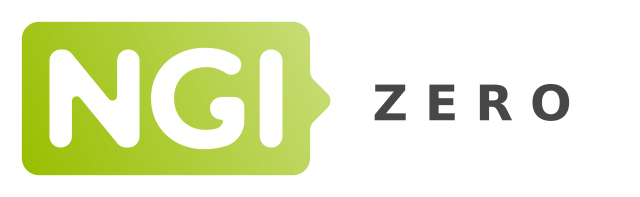

# Introduction

essai avec delphine

essai avec stéphane

## Présentation

**OpenStreetTouch** est un outil d'extraction de données OpenStreetMap (OSM) pour construire des plans tactiles de réseau de transport publique ou de petite zone de villes.

Une BrailleRAP XL à Gauche, Une BrailleRAP standard à droite.

 

## Financement

Ce projet est financé grace à [NGI0 Entrust](https://nlnet.nl/entrust), un fond créé par [NLnet](https://nlnet.nl) avec le support du programme  [Next Generation Internet](https://ngi.eu) de la Commision Européene. Plus d'informations ici [NLnet project page](https://nlnet.nl/project/BrailleRAP).

 
 

