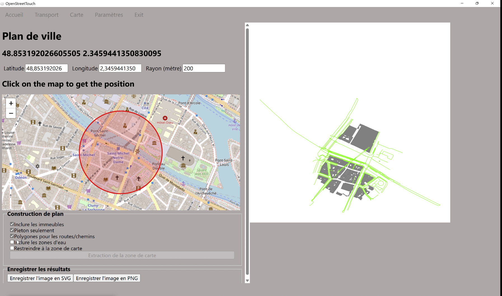
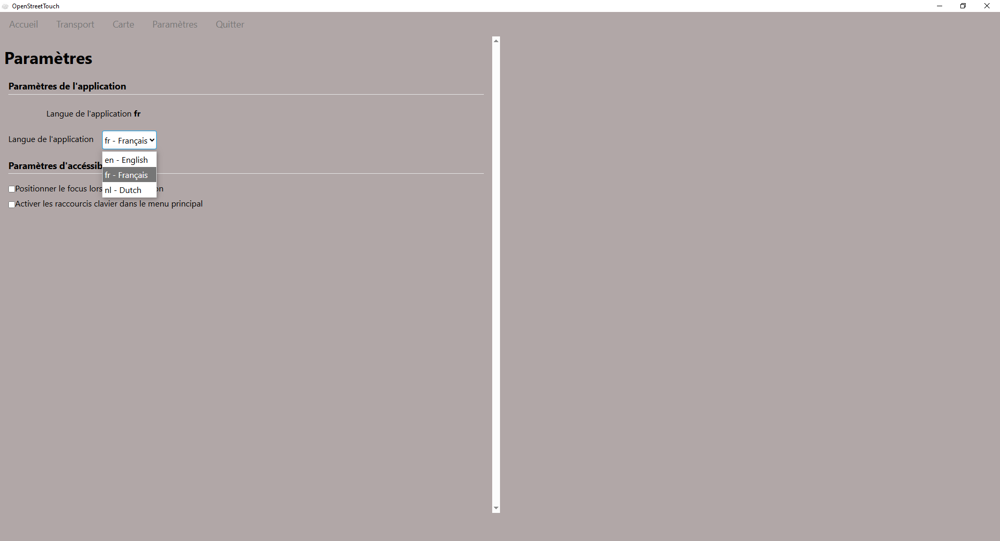

# Introduction
OpenStreetTouch est un programme  pour extraire des données géographiques depuis [OpenStreetMap](https://www.openstreetmap.org/). Il permet d'extraire à la fois des données sur les transports (carte des lignes et noms des stations) mais aussi d'extraire des cartes selon une zone définie par un rayon à partir d'un point central pour visualiser la position des routes et bâtiments.

Les fichiers générés en SVG sont ainsi compatibles avec les programmes Image2Touch ou [DesktopBraillerap](https://github.com/braillerap/DesktopBrailleRAP). L'objectif principal est d'extraire ces données pour créer des cartes tangibles, afin qu'elles soient accessibles aux malvoyants/non voyants.

Dans de nombreuses villes, les cartes de transports en commun ne sont pas disponibles en braille ni dans un format adapté aux déficients visuels. La plupart des données nécessaires sont disponibles dans OpenStreetMap sous licence Open Database. OpenStreetTouch vise à extraire ces données pour créer une carte des transports accessible.

Voici un exemple avec [DesktopBrailleRAP](https://github.com/braillerap/DesktopBrailleRAP) sur un quartier résidentiel en France

*Exemple d'une carte extraite avec OpenStreetTouch exploité avec [DesktopBrailleRap](https://github.com/braillerap/DesktopBrailleRAP) afin d'embosser cette carte avec l'embosseuse open source [BrailleRap](https://www.braillerap.org)*

# Fonctionnalités

- Créer une carte au format SVG à partir des données de transports publics. Ces fichiers SVG peuvent ensuite être utilisés pour créer une carte tangible avec une découpeuse laser, une imprimante 3D ou un BrailleRAP avec des logiciels comme Image2Touch ou DesktopBrailleRAP.
- Extraire les noms des stations à partir des données des transports public.
- Extraire un petit plan de ville pour créer une représentation accessible du quartier.

# Présentation de l'interface

Interface composée d’un menu avec un écran divisé en deux parties (gauche et droite). 
A gauche, le paramétrage et à droite la fenêtre de rendu.

Le menu est composé de 5 onglets que nous allons détailler: Accueil/Transport/Carte/Paramètres/Exit.

### Accueil : 

*Capture d'écran de la page d'accueil*

Numéro de version du programme , logos des partenaires (My Human Kit et NLNET Foundation) et lien vers Open street Map, programme source des données extraites par le programme Open street Touch

### Transport
Cet onglet permet d'extraire les lignes de transport d'une ville selon les paramètres définis par l'utilisateur.

#### 1- Définir les paramètres de l’extraction

*Interface des paramètres de l'extraction dans la partie gauche de la fenêtre*

- **Type Emplacement :**

  - Menu déroulant pour choisir si la recherche se fait par Nom de ville ou ID Wikidata (indispensable dans le cas où plusieurs villes ont le même nom)
  - Champs texte vide pour écrire le nom  de ville ou l’ID correspondant.

- **Langue de la ville :** Menu déroulant pour définir la langue de la ville (La langue utilisée pour exprimer le nom de la ville (fr pour Londres et en pour London par exemple)

- **Type de transport (OSM) :** Menu déroulant pour définir le type de transport Open Street Map à extraire (Métro, Funiculaire, Bus/Car, Tramway, train, Train interurbain, Monorail, Ferry)

#### 2- Cliquer sur bouton Rechercher et attendre que les données demandées apparaissent

*Interface avec le bouton Rechercher*

#### 3-Paramétrage de l’affichage des lignes de transport

##### Sélection des lignes à extraire
Une fois la recherche terminée, cocher chacune des lignes à intégrer à l’extraction

*Interface pour choisir les différentes lignes de transports à extraire avec les cases à cocher*

##### Configuration de l'affichage des lignes de transport

- **Dessiner les stations :** cocher cette option pour que les stations soient visibles sur la carte

- **Polygones pour tracés de lignes :** cocher cette option pour que les tracés soient dessinés avec des polygones ce qui revient à les dessiner avec des contours. Cette option est recommandée pour exploiter ce dessin avec une machine numérique, découpe laser par exemple.

- **Stratégie de rendu de la ligne de transport :** Menu déroulant pour choisir le type de rendu :  
  - **Données de tracé OSM** : fidèles à la représentation telle qu'elles sont dans Open Street Map    
  - **Données OSM corrigées** : utile quand le rendu présente des interruptions sur les lignes de transport
  - **Position des stations** : simplifie les tracés en reliant les stations par des lignes droites au lieu de respecter les courbes 

#### 4-Dessiner la/les lignes de transport 
**Dessiner la/les lignes de transport** : Cliquer sur le bouton pour générer le rendu dans la fenêtre de droite.

*Rendu dans la fenêtre de droite du dessin des lignes de transports choisies, avec l'option "dessiner les stations" et "polygone"*

#### 5-Visualiser le rendu dans la fenêtre de droite 

Le dessin des lignes de transport est généré dans la partie supérieure de la fenêtre de droite. 

*Rendu dans la fenêtre de droite quand l'option "dessiner les stations" est non cochée*

Sous le dessin de la carte du rendu, le nom de chaque ligne de transport s'affiche avec sa direction et toutes ses stations.

*Affichage du nom des stations sous le dessin des lignes de transports*

#### 6-Enregistrer les résultats
**Enregistrer l’image en SVG**  : Cliquer sur le bouton pour enregistrer le rendu de la carte au format SVG. C'est le format vectoriel, idéal pour être exploité par la suite par des machines à commandes numériques. 

**Ouvrir le svg pour voir le rendu avec un logiciel vectoriel (Inkscape par exemple)**

*Fichier svg ouvert dans Inkscape. Attention en mode Affichage>Normal on ne distingue pas les contours mais les couleurs comme sur une image matricielle.*

Passer en mode d’affichage Contour: Menu : Affichage > Contours

*Visualisation dans le logiciel vectoriel Inkscape des lignes de transport en mode polygone. Attention à bien choisir le mode affichage des contours pour les visualiser !*

*Visualisation dans le logiciel vectoriel Inkscape des lignes de transport en mode normal (mode polygone décoché)*

**Enregistrer l’image en PNG** : Cliquer sur le bouton pour enregistrer le rendu de la carte au format PNG. C'est le format matriciel, prêt à être imprimé en couleurs.

**Enregistrer les stations en TXT** :  Cliquer sur le bouton pour exporter l'ensemble des stations existantes sur les lignes sélectionnées pour le rendu (quand l'option "Dessiner les stations" a bien été coché dans les paramètres).

*Fichier du nom des stations de la ligne de transport, ouvert avec un éditeur de texte*

### Carte
**Plan de ville**

Cet onglet permet d'extraire une carte à partir d’un point central et d’un rayon. A noter que la carte extraite est au format rectangulaire (le cercle tracé à partir du rayon est transformé en rectangle pour la génération de la carte)

#### 1-Déterminer le périmètre du plan souhaité
**Le point central peut être défini de deux manières :**
- En renseignant les deux champs Latitude et Longitude 
- En cliquant directement sur la carte et zoomant avec la molette de la souris (ou avec les boutons + et - de l'interface) pour être précis sur la position souhaitée

**Rayon (mètre)** : Préciser dans ce champs le rayon d'extraction de données pour générer la carte

#### 2-Construction de plan 
##### Paramétrage de l'extraction des données
Cocher les options suivantes pour qu'elles soient inclues sur le plan.

- **Inclure les immeubles** : Inclure les bâtiments au plan
- **Piétons seulement** : générer uniquement les voies piétonnes 
- **Polygones pour les routes/chemins**: le mode polygone permet de générer les contours plus adaptés à l'exploitation de ce plan avec une machine à commandes numériques
- **Inclure les zones d'eau** : inclure les zones d'eau
- **Restreindre à la zone de carte** : respecter strictement la zone du rayon même si certains tracés sont coupés

*Exemple de rendu de carte en incluant les immeubles*

*Exemple de rendu de carte en incluant les immeubles et chemins piétons*

*Exemple de rendu de carte en incluant les immeubles et chemins piétons en mode polygone*

*Exemple avec toutes les options cochées*

##### Extraction du plan
- **Extraction de la zone de carte:** Cliquer sur le bouton pour générer le plan et le visualiser dans la fenêtre de rendu à droite

*Bouton pour extraire la zone de la carte*

#### 3-Enregistrer les résultats
- **Enregistrer l'image en SVG** : Cliquer sur le bouton pour générer le plan au format SVG
- **Enregistrer l'image en PNG** : Cliquer sur le bouton pour générer le plan au format PNG

### Paramètres
**Langue de l'application :** Menu déroulant pour choisir la langue de l'application actuellement disponible en français ou en anglais

*Choix de la langue dans le menu Paramètres*

### Exit 
**Quitter l'application** : Cliquer sur l'onglet Exit pour fermer l'application

Attention, cette action ferme sans demander si vous souhaitez enregistrer avant de quitter !